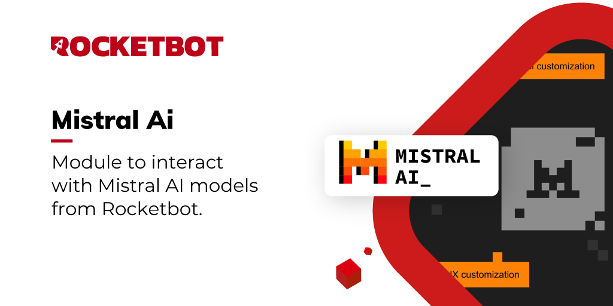

# Mistral AI
  
Módulo para interactuar con los modelos de Mistral AI desde Rocketbot.  

 

## Como instalar este módulo
  
Para instalar el módulo en Rocketbot Studio, se puede hacer de dos formas:
1. Manual: __Descargar__ el archivo .zip y descomprimirlo en la carpeta modules. El nombre de la carpeta debe ser el mismo al del módulo y dentro debe tener los siguientes archivos y carpetas: \__init__.py, package.json, docs, example y libs. Si tiene abierta la aplicación, refresca el navegador para poder utilizar el nuevo modulo.
2. Automática: Al ingresar a Rocketbot Studio sobre el margen derecho encontrara la sección de **Addons**, seleccionar **Install Mods**, buscar el modulo deseado y presionar install.  

## Cómo usar este módulo

Para usar este módulo, necesitamos obtener la clave API de MistralAi. Sigue estos pasos:

- Para comenzar, cree una cuenta Mistral o inicie sesión en [console.mistral.ai](https://console.mistral.ai/home).

- Luego, navegue a "Espacio de trabajo" y "Facturación" para agregar su información de pago y activar los pagos en su cuenta.
- Después de eso, vaya a la página "claves API" y cree una nueva clave API haciendo clic en "Crear nueva clave". Asegúrese de copiar la clave API, guardarla de forma segura y no compartirla con nadie.
## Descripción de los comandos

### Conectar con MistralAi
  
Establece conexión con Mistral AI
| Parámetros         | Descripción                                         | ejemplo          |
| ------------------ | --------------------------------------------------- | ---------------- |
| API Key            | Clave API de tu cuenta de Mistral                   | sk-abc123...     |
| Asignar a variable | Nombre de la variable donde se guardará la conexión | resultadoMistral |

### Obtener Modelos
  
Recupera los modelos disponibles de Mistral AI
| Parámetros         | Descripción                                                 | ejemplo          |
| ------------------ | ----------------------------------------------------------- | ---------------- |
| Asignar a variable | Nombre de la variable donde se guardará la lista de modelos | resultadoModelos |

### Generar Texto
  
Genera texto utilizando Mistral AI
| Parámetros                     | Descripción                                                    | ejemplo           |
| ------------------------------ | -------------------------------------------------------------- | ----------------- |
| Prompt                         | Texto de entrada para generar texto                            | Qué es Rocketbot? |
| Modelo                         | ID del modelo a utilizar                                       | mistral-tiny      |
| Asignar a variable             | Nombre de la variable donde se guardará el texto generado      | resultadoTexto    |
| Temperatura (opcional)         | Controla la aleatoriedad de la generación de texto (0.0 a 0.7) | 0.7               |
| Máximo de tokens (opcional)    | Número máximo de tokens a generar                              | 100               |
| Secuencia de parada (opcional) | Secuencia opcional para detener la generación de texto         | herramienta RPA   |

### OCR a Imagen/PDF
  
Procesa una imagen o PDF con el OCR de Mistral AI
| Parámetros         | Descripción                                                               | ejemplo                |
| ------------------ | ------------------------------------------------------------------------- | ---------------------- |
| Modelo             | Nombre del modelo OCR a utilizar                                          | mistral-ocr-latest     |
| Archivo o URL      | Permite subir un archivo local o ingresar una url hacia un archivo online | Ruta o URL del archivo |
| Asignar a variable | Nombre de la variable donde se guardará el resultado del OCR              | resultadoOCR           |
